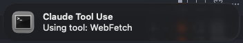
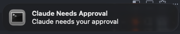

# Claude Notifier

A Rust-based notification system for Claude Code hooks. Sends native OS notifications when Claude performs various actions, with smart terminal detection and click-to-focus functionality.

## Examples

<div align="center">
  
  
</div>

## Features

- 🔔 **Native OS Notifications** for Claude Code events:
  - Approval requests
  - Tool usage (with special handling for Bash commands)
  - Task completion
  - All other Claude Code hook events
- 🖥️ **Smart Terminal Detection**: Automatically identifies your terminal/IDE
- 🎯 **Click-to-Focus** (macOS): Action buttons to jump back to the originating terminal
- 📊 **Session Management**: Tracks multiple concurrent Claude Code sessions
- ⚙️ **Highly Configurable**: Customize notifications, sounds, and behaviors

## Installation

```bash
# Clone the repository
git clone https://github.com/alexjaniak/claude-notifier.git
cd claude-notifier

# Build the project
cargo build --release

# The binary will be in target/release/claude-notifier
```

## Setup

1. Copy the example configuration file:
```bash
cp config.toml.example config.toml
```

2. Edit `config.toml` to customize settings:
- Enable/disable notifications per event type
- Adjust notification timeout
- Customize notification sounds (macOS)
- Configure click-to-focus behavior
- Enable debug mode for troubleshooting

3. Configure as a Claude Code hook (see Usage section)

## Usage with Claude Code

### Configure as a Hook

Add to your Claude Code settings (`.claude/settings.local.json`):

```json
{
  "hooks": {
    "Notification": [
      {
        "hooks": [
          {
            "type": "command",
            "command": "{PATH_TO_REPO}/target/release/claude-notifier"
          }
        ]
      }
    ],
    "Stop": [
      {
        "hooks": [
          {
            "type": "command",
            "command": "{PATH_TO_REPO}/target/release/claude-notifier"
          }
        ]
      }
    ],
    "PreToolUse": [
      {
        "matcher": "*",
        "hooks": [
          {
            "type": "command",
            "command": "{PATH_TO_REPO}/target/release/claude-notifier"
          }
        ]
      }
    ]
  }
}
```

Replace `{PATH_TO_REPO}` with the absolute path where you cloned the repository.

Once configured, restart claude-code and make sure have notifications enabled for your IDE / terminal. You should start to get notifications for: 
- 🟡 **Approval Requests**: When Claude needs your permission
- 🔧 **Tool Usage**: When Claude runs commands or uses tools
- ✅ **Task Completion**: When Claude finishes tasks
- 📢 **Other Events**: Any other Claude Code hook events

### Supported Terminals/IDEs

The notifier can detect and activate:
- **Cursor** - AI-powered IDE
- **Visual Studio Code**
- **iTerm2**
- **Terminal.app**
- **Warp**
- **Alacritty**
- **WezTerm**
- **Kitty**
- **Hyper**

## Contributing

For suggestions and contributions, reach out to [@waniak_](https://x.com/waniak_) on X.

## License

MIT License - see the [LICENSE](LICENSE) file for details.